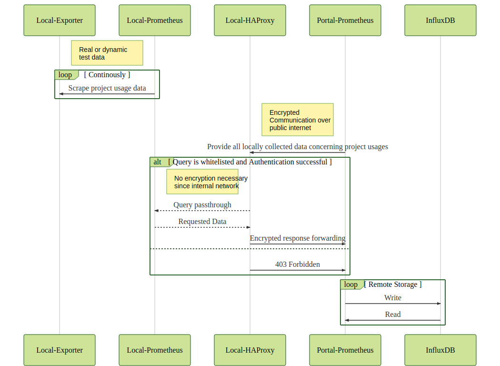

# Openstack Projekt Monitoring

This repository contains the *docker-compose* scripts needed to setup a project-usage
monitoring system. See the graphic below to understand how all components interact with
each other.



One base idea is to use as much features of *Prometheus* as possible, namely its metrics
format and federation capabilities. Ideally every site (the deployment target of the
*Local-* Stack) with an OpenStack instance can reuse the local prometheus instance for
monitoring of additional services.

## Local-* /Site

### Exporter

This is an [project usage exporter](https://github.com/gilbus/OS_project_usage_exporter)
with the ability to either serve real production data or fake data for
testing/development purposes. For more information see the linked repository.

### Prometheus & HAProxy

HAProxy is used to restrict the access of the *Portal-Prometheus* instance to the
`/federation` API. Since the organisations running the portal and the local site setup
might be different and in case the local prometheus instance is monitoring additional
services the local site might **not** want to make all collected metrics available to
the portal. Therefore the request of the Portal-Prometheus is matched against
a whitelisted query.

Since Prometheus does not offer HTTP Authentication mechanism in terms of access control
but is able to provide
a [`bearer_token`](https://prometheus.io/docs/prometheus/latest/configuration/configuration/#<scrape_config>)
when scraping targets the HAProxy only allows/forwards requests presenting the
configured token.

## Production Compose


### Site

You need to provide an `openrc` file (tested with `v3`) and save it as `usage-openrc`.
Download it from inside *horizon* and modify it to only contain `key=value` pairs.
Quotes around `values` are not allowed. Example:

```bash
OS_AUTH_URL=your_url
OS_PROJECT_ID=your_id
OS_PROJECT_NAME=admin
OS_USER_DOMAIN_NAME=Default
OS_PROJECT_DOMAIN_ID=default
OS_PASSWORD=your_passwd
OS_REGION_NAME=your_region
OS_INTERFACE=public
OS_IDENTITY_API_VERSION=3
```
(Possibly less values are needed, i would be glad about a pull request :wink:)

You can start all `Local-*` services with the following command:

```
docker-compose --file docker-compose.site.yml up --detach --build
```

Afterwards `docker ps` should include the following lines (names will be different, depending on the name of `$PWD`):
```
CONTAINER ID        IMAGE                                   COMMAND                  CREATED             STATUS              PORTS                    NAMES
84438ff5ebda        haproxy:1.8-alpine                      "/docker-entrypoint.…"   15 minutes ago      Up 15 minutes       80/tcp                   project_usage_prometheus_proxy_1
e0da4eb94024        prom/prometheus                         "/bin/prometheus --c…"   15 minutes ago      Up 15 minutes       9090/tcp                 project_usage_prometheus_1
beaffc7f68e6        tluettje/os_project_usage_exporter:v2   "python project_usag…"   16 hours ago        Up 10 minutes       8080/tcp                 project_usage_exporter_1

```

You can test a successful connection to your openstack instance by taking a look at the
logs of the container (`docker logs project_usage_exporter_1`) or by inspecting the
exported usage values. The name of the container might be different

```bash
curl $(docker inspect project_usage_exporter_1 | jq --raw-output \
  '.[].NetworkSettings.Networks.project_usage_usage_exporter.IPAddress'):8080
```

## Development Compose

```
docker-compose -f docker-compose.portal.yml -f dev/docker-compose.override.yml up -d --build
```

This setup includes all services shown in the diagram and additionally:
- 2 *Local-* Stacks according to the diagram above, the two
  [exporter](https://github.com/gilbus/OS_project_usage_exporter) are running in dummy
  mode

Most of the services bind to local ports, use `docker ps` to determine the mappings.
